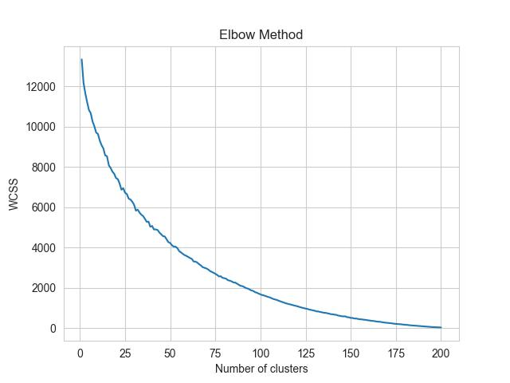

# GDP Analysis

This repository provides visualizations of the GDP of top economies and influential groups of countries in different perspectives.

## Top 5 Economies by Nominal GDP

In this visualization, we highlight the top 5 countries by their nominal GDP in US dollars. A couple of points to note:
- Russia's data starts appearing only from the year 1980 due to the dissolution of the Soviet Union and the subsequent creation of the Russian Federation.
- China's economic rise can be observed distinctly as it gradually catches up with the US. However, it's worth mentioning that this visualization does not provide an entirely accurate representation of economic expansion. This is because a part of the GDP increase over the years can be attributed to inflation, which might inflate the growth numbers.

## Top 8 Economies as a Percentage of World GDP

This visualization focuses on the top 8 economies, but instead of nominal GDP values, we are representing each country's GDP as a percentage of the world's total GDP. This perspective provides insights into the relative size of various economies in comparison to the global economy.

## Groups of Countries: G7, BRICS, and OECD

Here, we pivot our focus towards influential groups of countries:
- **G7**: A group of seven advanced economies - Canada, France, Germany, Italy, Japan, the United Kingdom, and the United States. Note: The European Union, though a part of the G7 discussions, is excluded from this analysis.
- **BRICS**: An association of five major emerging economies - Brazil, Russia, India, China, and South Africa.
- **OECD**: The Organisation for Economic Co-operation and Development, which consists of [list all member countries or a link to the member list here].

In this visualization, we depict the GDP of these groups as a percentage of the world's GDP, providing an overview of their economic influence and footprint on the global stage.

## GDP Growth Rate Analysis and Correlation Matrix

After analyzing the nominal GDP values and their proportions to the global economy, we shifted our focus to understanding the dynamics of economic expansion or contraction. For this, we derived an alternative dataset representing the **percentage change in GDP** for each country from one year to the next. 

It's crucial to note that while this dataset provides insights into the relative economic growth rates, it doesn't factor out inflation since it's not based on constant prices for a specific base year.

### Correlation Matrix Visualization

To explore the interdependence and interconnectedness of global economies, we computed a correlation matrix of the GDP growth rates. This visualization presents the correlation coefficients of the top 20 economies:

From the matrix:
- Strong correlations can be observed among certain neighbor countries. For instance, Spain, France, Italy, Netherlands and Germany showcase strong economic ties.
- Interestingly, geographical proximity doesn't always imply economic interdependence. A testament to this is the observed decoupling between economies like China and Japan, despite being geographical neighbors.

Such insights underscore the importance of diverse economic, political, and strategic factors that shape the growth patterns and interdependencies of global economies.

## K-means Clustering of Countries Based on GDP Growth Rates

Seeking patterns and grouping countries based on similar GDP growth rates, we attempted to employ the K-means clustering algorithm. Using the annual percentage increase in GDP as the primary feature, the goal was to identify clusters of countries exhibiting similar economic growth behaviors over the years.

### Challenge with the Elbow Method

Determining the optimal number of clusters is a pivotal step in K-means clustering. Typically, the "Elbow Method" is employed, where the sum of squared distances to the nearest cluster center is plotted for a range of cluster numbers. The point where the decrease in this sum becomes marginal (forming an "elbow") suggests the optimal number of clusters.

However, as observed in our analysis, finding a clear and definitive elbow point proved challenging:

This highlights the intricacies and complexities of global economic patterns. Countries' economies can vary significantly and may not always neatly group into distinct clusters based solely on GDP growth rates.
